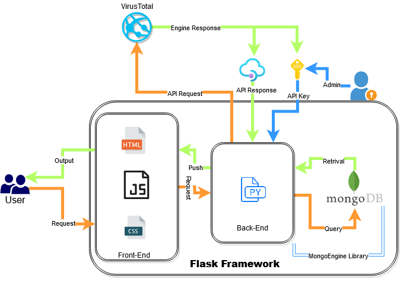

# BlackPearl
### Scanner de réputation
```
Version: BlackPearl BETA.2020x 
```

#### Description
``` 
Project created for assessment of subject "NoSQL Databases"
This app aims to scan reputation of the IPs and Domains.
Gives important data with respect to the scan site.
```
## Author:
```
- PATIL Kunal
- CRASTA Nikhil-Gavin
(Students, MSc, Artificial Intelligence
EPITA)
```

## Architecture



## Resources used:
```
Framework: Flask RESTful

Languages used:
    Python 
    Mongodb
    HTML
    CSS
    Javascript
        
IDEs: 
Pycharm Professional 2019.3
MongoDB Compass
Postman
```

## Arborsence
```
Blackpearl
    |- static
        |- <css and ico files>
    |- database
        |- db.py (initializing MongoEngine)
        |- models.py (defining collections)
    |- templates
        |- <All html files for creating app view>    
    |- app.py (Entry point of the application)
    |- api.py (functions for accessing the collections)
    |- config.json (credentials for application)
    |- requirements.txt (packages required for the project)    
    
```


## Future Enhancements:
```
1. Implementing secure APIs
2. Secure LogIn for users
3. Adding functionalities:
    a. file hash
    b. url analysis
    c. file upload and calculate potential exploitability
4. Create an webservice
5. Deploy with docker
``` 

## Github:
https://github.com/kunalpatz/BlackPearl.git